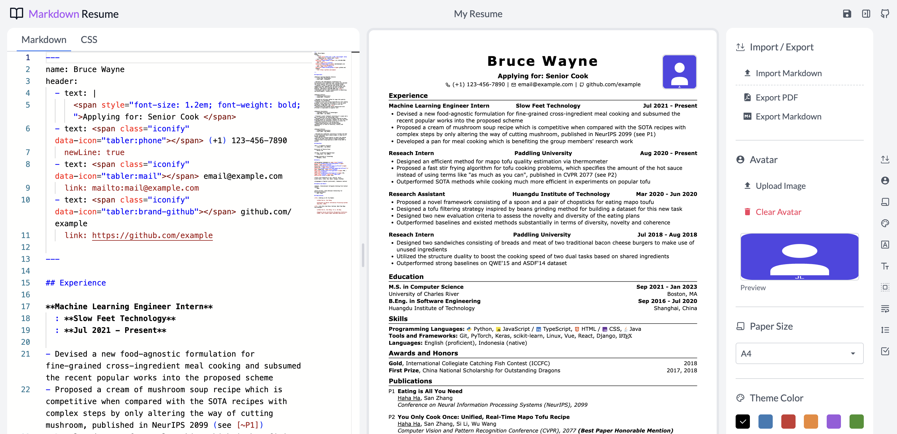

<h1 align="center">Markdown Resume with Avatar Support</h1>

<p align="center">Write an ATS-friendly Resume in Markdown. Available for anyone, Optimized for Dev & Avatar Support.</p>

<p align="center"><a href="https://www.junian.dev/markdown-resume/"><strong>Start Writing Now</strong></a>!</p>



## About

A fork of "Oh My CV!" by junian. You can visit the original work [here](https://www.junian.dev/markdown-resume/).

## Avatar Support

This fork introduces a new **Avatar Support** feature that allows you to personalize your resume with a professional photo. Here's what's new:

- **Easy Avatar Upload**: Click the avatar icon in the toolbar to upload and display your personal photo in the top-right corner of your resume
- **Perfect Alignment**: The avatar is automatically aligned with your name for a professional appearance
- **Square Format**: Optimized for square personal photos that maintain their aspect ratio
- **Local Storage**: Your uploaded avatar is stored locally in your browser for privacy and convenience

### Example Avatar

An example avatar (`cvs/avatar.svg`) is included in the repository to demonstrate the feature.

### Important Note

⚠️ **The [Start Writing Now](https://www.junian.dev/markdown-resume/) online version does not currently support the avatar feature**, as these changes have not yet been deployed to the website. To use the avatar functionality, you'll need to clone this repository and run it locally following the development instructions below.

## Notice

Highly recommend using Chromium-based browsers, e.g., [Chrome](https://www.google.com/chrome/) and [Microsoft Edge](https://www.microsoft.com/en-us/edge).

## Features

- Write your resume in Markdown and preview it in real-time, it's smooth!
- It works offline ([PWA](https://developer.mozilla.org/en-US/docs/Web/Progressive_web_apps))
- It supports avatar upload.
- Export to A4 and US Letter size PDFs
- Customize page margins, theme colors, line heights, fonts, etc.
- Pick any fonts from [Google Fonts](https://fonts.google.com/)
- Add icons easily via [Iconify](https://github.com/iconify/iconify) (search for icons on [Icônes](https://icones.js.org/))
- Tex support ([KaTeX](https://github.com/KaTeX/KaTeX))
- Cross-reference (would be useful for an academic CV)
- Case correction (e.g. `Github` -> `GitHub`)
- Add line breaks (`\\[10px]`) or start a new page (`\newpage`) just like in LaTeX
- Break pages automatically
- Customize CSS
- Manage multiple resumes
- Your data in your hands:
  - Data are saved locally within your browser, see [here](https://localforage.github.io/localForage/) for details
  - Open-source static website hosted on [Github Pages](https://pages.github.com/), which doesn't (have the ability to) collect your data
  - No user tracking, no ads
- Dark mode

## Development

It's built on [Nuxt 3](https://nuxt.com), with the power of [Vue 3](https://github.com/vuejs/vue-next), [Vite](https://github.com/vitejs/vite), [Zag](https://zagjs.com/), and [UnoCSS](https://github.com/antfu/unocss).

Clone the repo and install dependencies:

```bash
pnpm install
```

Build some [packages](packages):

```bash
pnpm build:pkg
```

To enable picking fonts from [Google Fonts](https://fonts.google.com/), you will need to generate a [Google Fonts Developer API Key](https://developers.google.com/fonts/docs/developer_api#APIKey). Then, create a `.env` file in [`site`](site/) folder and put:

```
NUXT_PUBLIC_GOOGLE_FONTS_KEY="YOUR_API_KEY"
```

Start developing / building the site:

```bash
pnpm dev
pnpm build
```

## Credits

- The `oh-my-cv` work: [Renovamen/oh-my-cv](https://github.com/Renovamen/oh-my-cv)
- The origin work: [junian/markdown-resume](https://github.com/junian/markdown-resume)
- [billryan/resume](https://github.com/billryan/resume)

## License

This project is licensed under [MIT](LICENSE) license.
